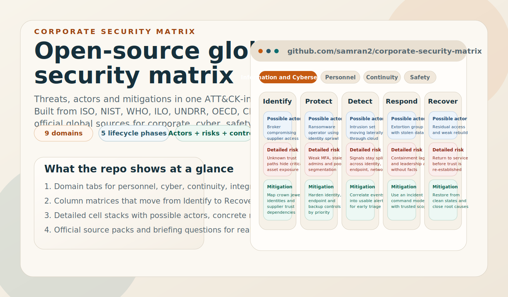
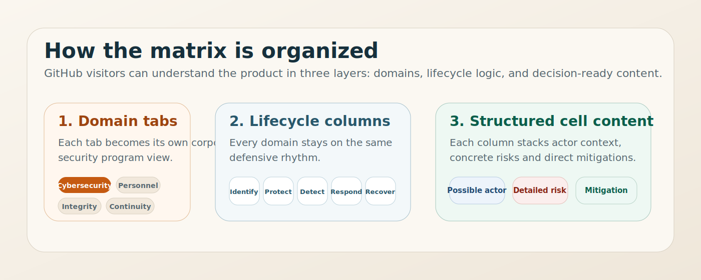

# Corporate Security Matrix



An open-source, English-language corporate security matrix for organizations of any size and sector.

Suggested GitHub repository slug: `corporate-security-matrix`

The project is built from globally reusable source packs drawn from standards bodies, intergovernmental organizations and official regulator guidance. EK is retained as one useful supporting source, but the structure and content are not built around EK alone.

## At a glance

- `9 domains` covering corporate, physical, cyber, continuity, compliance, environmental and worker safety concerns
- `5 lifecycle phases` in every domain: Identify, Protect, Detect, Respond, Recover
- `3 decision layers` in every matrix cell: possible actors, detailed risks and mitigations
- `1 visual operating model` that makes the repository understandable directly on GitHub, before opening the live site



## Mission

Build a practical matrix that helps organizations:

- see threats and controls in one operating picture
- align leadership, security, operations, safety and compliance teams
- reuse a shared structure across countries and sectors
- start with official guidance instead of opinion pieces

## Source hierarchy

The repository is intentionally not centered on any single national framework.

1. International standards and global frameworks such as ISO, NIST, WHO, ILO, UNDRR, UNODC, OECD, IFC, ENISA and CISA shape the matrix first.
2. National or regional frameworks are used only when they add transferable structure or terminology.
3. EK is treated as a useful comparator and supporting reference, not as the governing taxonomy.

## What the project contains

- `index.html` for the site shell and preview
- `styles.css` for the visual system and responsive matrix layout
- `assets/github-preview.svg` for the GitHub-facing visual repository preview
- `assets/matrix-anatomy.svg` for the matrix structure explainer used in the README
- `matrix-domains.js` for lifecycle phases and domain matrix content
- `matrix-actors.js` for possible actor profiles by domain and lifecycle
- `matrix-briefs.js` for domain briefings, ownership framing and phase guidance
- `matrix-references.js` for official source packs and evidence links
- `app.js` for the UI state, rendering and interaction logic
- `SOURCE-LIBRARY.md` for the human-readable evidence base
- `FACT-CHECK.md` for source verification notes and corrected official titles
- `CONTRIBUTING.md` for contribution rules
- `CODE_OF_CONDUCT.md` for collaboration norms
- `SECURITY.md` for project reporting guidance
- `security_best_practices_report.md` for the latest static-site security audit
- `scripts/validate_project.py` for repeatable validation
- `.github/workflows/validate.yml` for CI validation on pushes and pull requests
- `LICENSE` for reuse terms

## Matrix model

Tabs open domain-specific matrices in an ATT&CK-style interaction pattern:

- People and Personnel Security
- Physical and Site Security
- Emergency Preparedness and Life Safety
- Operations, Supply Chain and Quality
- Environmental and Hazardous Materials Safety
- Information and Cybersecurity
- Integrity, Compliance and Investigations
- Business Continuity and Crisis Management
- Occupational Health and Safety

Each domain tab uses the same defensive lifecycle:

- Identify
- Protect
- Detect
- Respond
- Recover

Each matrix cell contains:

- `Possible actors`: plausible insiders, external actors, negligent parties or failure sources
- `Detailed risks`: likely loss patterns, abuse paths or disruption modes
- `Mitigations`: practical measures that prevent, detect, contain or recover

Each active domain also includes a briefing layer with mission, protected assets, likely owners, failure modes and leadership questions. This makes the UI usable both as a leadership overview and as a domain-level working canvas for security, safety, operations, compliance and resilience teams. Each lifecycle column renders as a stack of actor, risk and mitigation entries rather than a single text block.

## Implementation workflow

Use the matrix as an operating tool, not just documentation.

1. Assign an accountable owner to each domain.
2. Score each lifecycle cell for current coverage, not intended policy.
3. Attach your applicable laws, standards, insurer requirements and customer obligations to the relevant cells.
4. Prioritize investment where high-impact cells show weak prevention, detection or recovery capability.
5. Refresh the matrix after exercises, incidents, acquisitions, major supplier changes and major technology change.

## Source policy

This repository is intentionally strict about sources.

- Prefer primary sources only.
- Start with international standards, UN-family organizations, OECD, NIST, CISA, ILO, IFC and similar official bodies.
- Use national regulator guidance only when it transfers well internationally.
- Avoid vendor blogs, consulting think pieces and unattributed summaries.
- Keep matrix text as original synthesis, not copied standard text.

## Security posture

The static site is hardened for low-risk public hosting:

- no third-party scripts
- no analytics, cookies or browser storage
- no dynamic HTML injection or string-based code execution
- no external font dependency
- meta-delivered CSP for static-hosting compatibility
- `noopener noreferrer` on external links

For production hosting, verify runtime headers that cannot be fully enforced through HTML meta tags alone.

## Validation

Run the release checks locally before publishing:

```bash
node --check matrix-domains.js
node --check matrix-actors.js
node --check matrix-briefs.js
node --check matrix-references.js
node --check app.js
python3 scripts/validate_project.py
python3 -m http.server 8000
```

Then verify:

- `http://127.0.0.1:8000/index.html`
- `http://127.0.0.1:8000/matrix-domains.js`
- `http://127.0.0.1:8000/matrix-actors.js`
- `http://127.0.0.1:8000/matrix-briefs.js`
- `http://127.0.0.1:8000/matrix-references.js`
- `http://127.0.0.1:8000/app.js`
- `http://127.0.0.1:8000/styles.css`

The repository also includes a GitHub Actions workflow at `.github/workflows/validate.yml` to run syntax checks, link validation and a static-site smoke test on every push and pull request.

## Open-source use

The project is released under the MIT License. External linked standards, frameworks and publications remain under their respective owners and licenses.

## Run locally

Open `index.html` in a browser, or serve the folder locally:

```bash
python3 -m http.server 8000
```

Then browse to `http://127.0.0.1:8000`.

## Publish on GitHub Pages

1. Push these files to the root of a GitHub repository.
2. Enable GitHub Pages from repository settings.
3. Use the `main` branch and `/ (root)` as the source.

No build step is required. The `.nojekyll` file is included so GitHub Pages serves the repository as a plain static site without Jekyll processing.

## Source material

- Global evidence base: see `SOURCE-LIBRARY.md`
- EK corporate security page: <https://ek.fi/hyotytietoa-yrityksille/yritysturvallisuus/>
- Official English EK PDF: <https://ek.fi/wp-content/uploads/2025/10/Yritysturvallisuusmalli_tekstiosuudet_2025_EN_Final.pdf>

## Note

This project is inspired by the matrix interaction pattern of MITRE ATT&CK, but it is not a MITRE ATT&CK taxonomy or derivative technique catalog.
